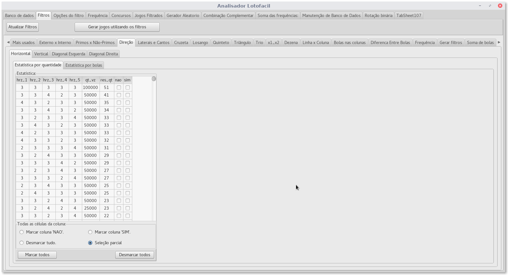
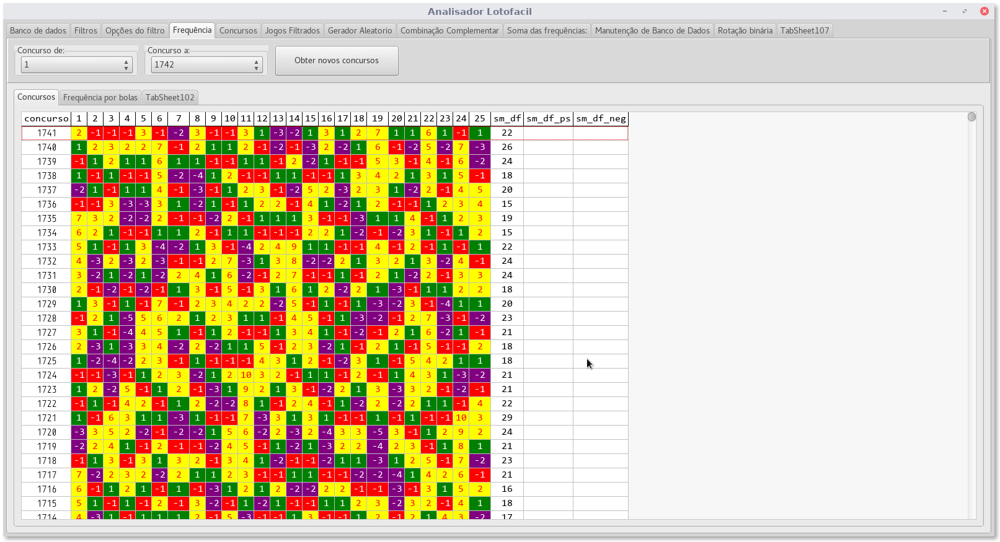
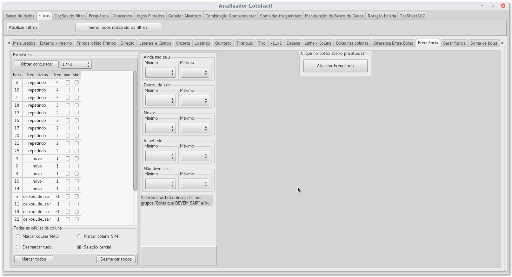

Analisador Lotofacil
======================
Autor: *Fábio Moura de Oliveira*

Aumente suas chances de acertar no jogo da lotofacil

Este programa realiza as seguintes análises estatísticas:
* novos x repetidos
* par x ímpar
* primo x não-primos
* externo x interno
* horizontal
* vertical
* diagonal esquerda
* diagonal direita
* esquerda x direita
* superior x inferior
* canto superior esquerdo x canto inferior direito
* canto superior direito x canto inferior esquerdo
* cruzeta
* losango
* quinteto
* triangulo
* trio
* x1 x x2
* dezena
* unidade
* quantidades de vezes que cada bola saiu por coluna
* frequência relativa a qualquer concurso já inserido
* diferença entre bolas por concurso

Pra utilizar o analisador lotofacil.
=====================================
* Baixe postgresql em 
* Instale postgresql.
* Baixe o banco de dados 'lotofacil' em: :

Ao baixar haverá uma pasta com o nome 'lotofacil_2018_12_05', que indica o ano, mês e dia que o banco de dados se refere, também,
pra o programa 'Analisador Lotofacil', haverá tags que identifica a qual banco de dados, o programa se refere.

Haverá dentro da pasta, 8 arquivos de nome: 'lotofacil_aa', 'lotofacil_ab', 'lotofacil_ac', 'lotofacil_ad', 'lotofacil_ae',
'lotofacil_af', 'lotofacil_ag', 'lotofacil_ah' e 'lotofacil_ai'.

O que foi feito, foi dividir um arquivo grande 'lotofacil_2018_12_05.7z' de 2.1 GiB (Gibibyte) em 4 arquivos com no máximo 250 MiB (Megabibyte), pra facilitar o processo de dowload.

Eu estou utilizando linux, e utilizei o comando 'split -b=250m lotofacil_2018_12_05.7z' pra separar os arquivos
em partes de 250MiB.

Então, ao baixar a pasta, vc precisa unir os arquivos novamente, pra isto utilize:
# No windows:
`copy /B lotofacil_aa + lotofacil_ab + lotofacil_ac + lotofacil_ad + lotofacil_ae + lotofacil_af + lotofacil_ag + lotofacil_ah + lotofacil_ai  lotofacil_2018_12_05.7z`

# No linux e no Mac:
`cat lotofacil_aa lotofacil_ab lotofacil_ac lotofacil_ad lotofacil_ae lotofacil_af lotofacil_ag lotofacil_ah lotofacil_ai > lotofacil_2018_12_05.7z`

Em seguida, temos um arquivo comprimido, descompacte este arquivo, em uma pasta temporária ou qualquer outra pasta.

Ao descomprimir teremos uma pasta de nome 'lotofacil_2018_12_05_directory'.

Dentro desta pasta, há vários arquivos comprimidos, tais arquivos corresponde ao backup do banco de dados 'lotofacil'
que efetuei utilizando o comando 'pg_dump', eu utilizei o comando com a opção pra efetuar o backup dos arquivos em um diretorio.

Agora, o procedimento é bem simples, utilizado o pgAdmin, crie um novo banco de dados e depois em seguida, clique
com o botão direito e escolher 'restore', vc deve escolher 'Directory' pra a opção 'Format'.

Depois, em 'FileName', vc deve apontar pra o caminho da pasta 'lotofacil_2018_12_05_directory'.

Em 'rolename', escolheu a opção desejada.

Pronto, temos o banco de dados criado.

Agora, vc deve baixar lazarus, versão 1.8.

Instale Lazarus, em seguida, vai pra a pasta de examples e procure um projeto de nome 'Online Packager Manager', instale-o.

Em seguida, na guia 'Tools' ou 'Ferramentas' abra 'Online Package Manager' e procure por Indy e instale o pacote pois nosso programa depende deste pacote.

Agora, baixe o repositório do Analisador Lotofacil e em seguida, abra-o em Lazarus e compile.

Inicie o programa e configure teu banco de dados na guia 'Banco de dados',

Gere filtros baseados nas estatísticas escolhidas.

Atualize a tabela de resultados com um único clique.

